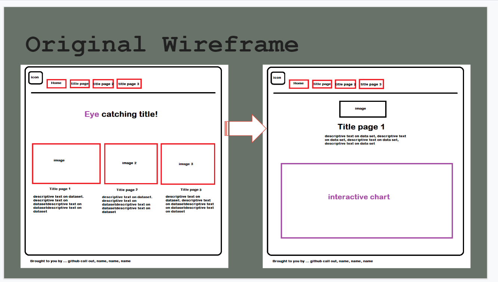
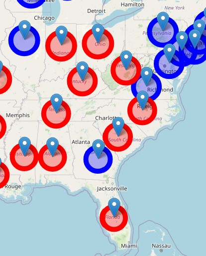
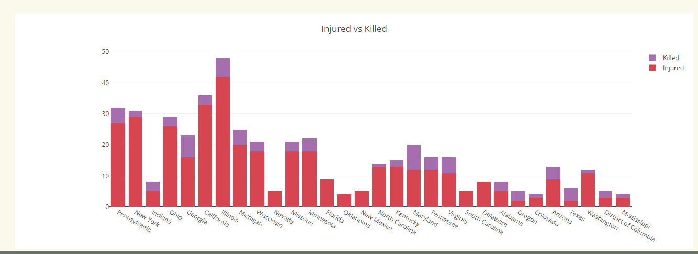

# Project 3 
## Gun Violence in America

### Description:

We all know that gun violence in the US is prevalent, but is gun violence getting worse over the years? For our project, we will use an interactive  dashboard to show viewers the impact that guns have had over the years across the US. How has the pandemic impacted gun violence? Has gun violence increased in a certain state, and does being a red state or a blue state affect their safety from the dangers of guns? Our goal is to create a visual presentation of the data that we find to answer these questions.

### Datasets:

* <a href="https://www.gunviolencearchive.org/mass-shooting">Gun Violence Archive: Mass Shootings</a>
* <a href="https://www.safehome.org/data/firearms-guns-statistics/#police">Safehome: Police Firearms Gun Statistics</a>
* <a href="https://www.gunviolencearchive.org/accidental-injuries">Gun Violence Archive: Accidental Injuries</a>
* <a href="https://www.gunviolencearchive.org/accidental-deaths">Gun Violence Archive: Accidental Deaths</a>
* <a href="https://worldpopulationreview.com/state-rankings/gun-ownership-by-state">Gun Ownership By State</a>
* <a href="https://en.wikipedia.org/wiki/Political_party_strength_in_U.S._states">Political Party Strength in US States</a>

### Database:

For this project, we decided to use MongoDB for our database.

### Tasks:

* Set up database 
* Clean data 
* Flask API
* HTML/CSS frame of website
* Interactive Map 
* Drop Down Charts 
* PowerPoint Presentation 

### Sketch:

### ETL Methodology Used:
* Data was  pulled into a Jupyter notebook and cleansed using python to ensure the dataset had consistency across data sets . The date chosen were after 2019.  
* Fields Needed For Charts - # Killed, # Injured, State, Year
* Fields Needed For Map - State, Gun Ownership Percentage

### Flask Application Overview:
 
With the database loaded, we connect MongoDB and import the data to active Api for visualization with Javascript

 

### Decorating The Site:

https://coolors.co/334bff-4d2d52-f4d58d-697268-d64550

### Visualizations

* Gun ownership by State - Interactive map

* Injured vs Killed visualization

* Dashboard for Gun violence
   
The dashboard contains pie charts for gun violence vs.party affiliation, bar chart for the total death count of each states and line chart representing three different kinds of gun violence. With a dropdown to see the data from year to year

   
Pie charts: charts are created using Javascript chart.js library base on the gun ownership by states data and gun death by states. Which shows the total counts for guns and death in blue vs. red states.
 
 

    
   
Bar chart and line chart: The bar chart and line chart are made by chart.js as well. The data is the combined dataset that contains the information per year and state. these two charts will show new data base on the dropdown selections

    
